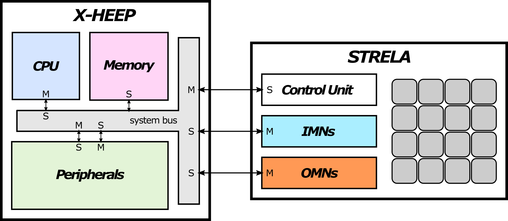

# X-TRELA SoC

X-HEEP + STRELA.

#### X-HEEP configuration

`CPU=cv32e40p, BUS=NtoM, MEMORY_BANKS=4, MEMORY_BANKS_IL=4`

#### Software

This repository contains benchmark applications for the STRELA CGRA.

---

Link to [X-HEEP](https://github.com/esl-epfl/x-heep)

Link to [STRELA](https://github.com/des-cei/strela)

---