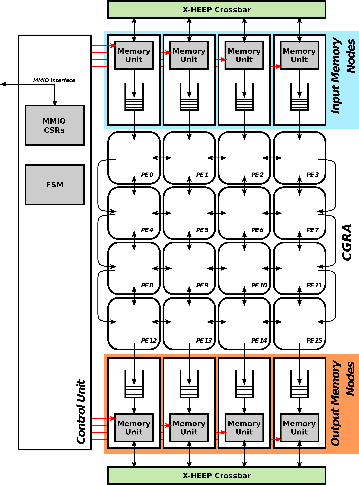
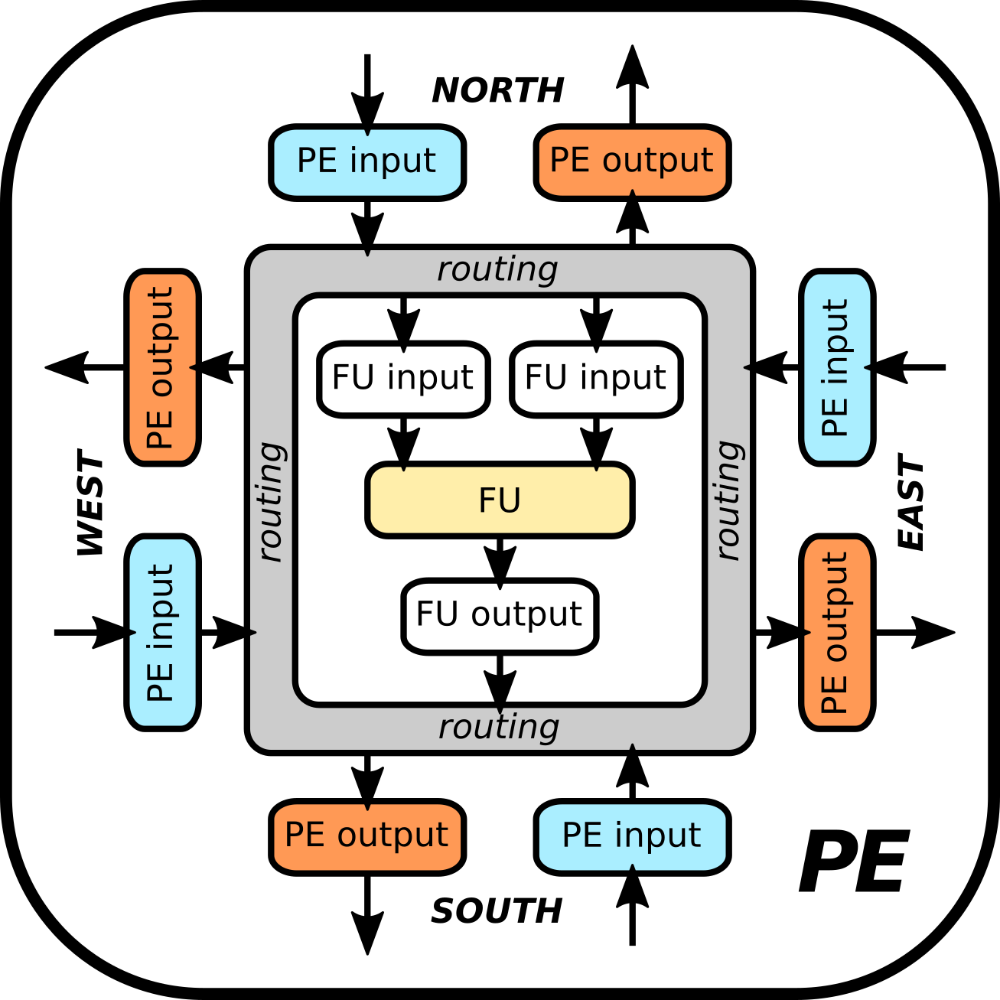
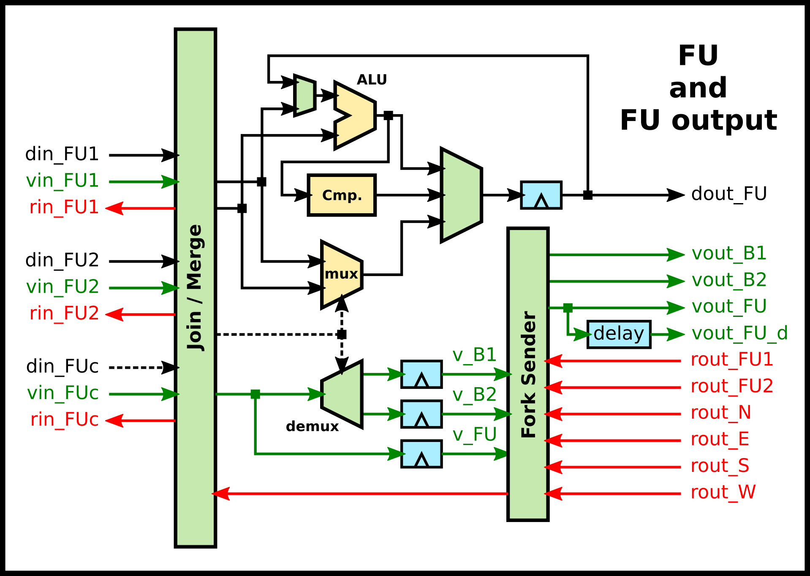
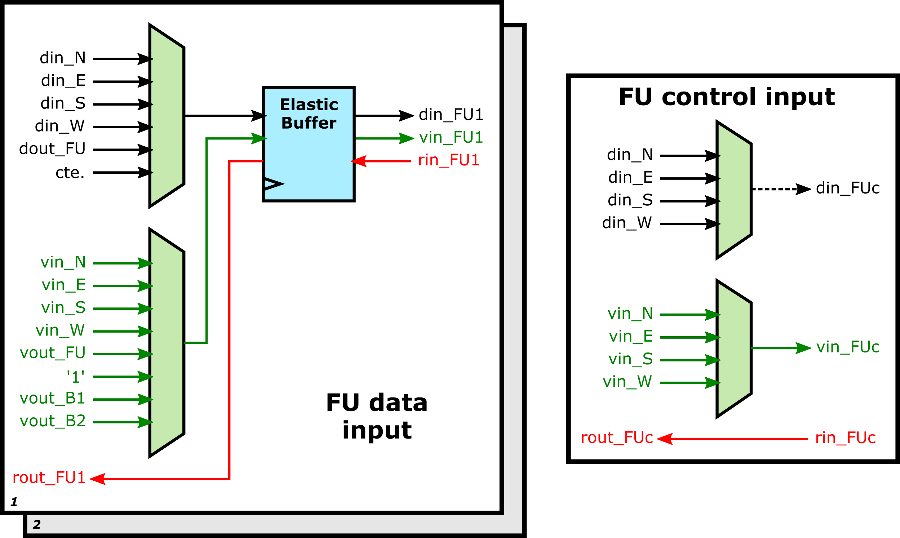
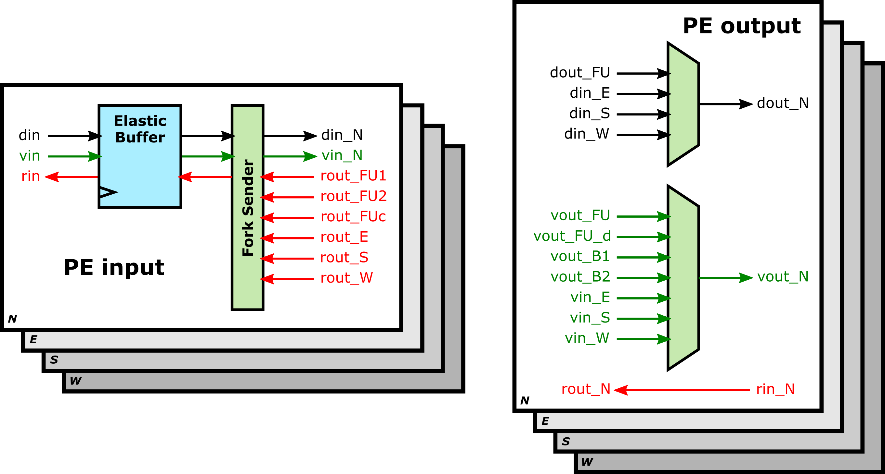

# STRELA (STReaming ELAstic CGRA)

STRELA is a reconfigurable IP designed for accelerating compute-intensive tasks. It contains an elastic Coarse-Grained Reconfigurable Architecture (CGRA), 8 independent streaming memory nodes to load and store data, and a control unit.

### CGRA overview
STRELA leverages a CGRA to provide high throughput and energy efficiency for domain-specific applications of the embedded domain. It is particularly suited for tasks requiring data parallelism and regular computation patterns, such as loops. It uses elastic logic (ie. valid/ready protocols) to support latency.

It is made up of Processing Elements (PE) with the following structure:

#### Functional Unit (FU)

The FUs are able to perform data- and control-oriented operations:
- *add*, *sub*, *mul*, *sub*, *shl*, *shra*, *shrl*, *AND*, *OR*, and *XOR* data-oriented operations.
- *branch*, *merge*, and *if/else* control-oriented operations.

#### FU inputs

#### PE inputs and outputs

### Compiling Framework

Coming soon!

### License
This project is licensed under the Solderpad Hardware License, Version 2.1, see [License](./LICENSE.md) for details. SPDX-License-Identifier: Apache-2.0 WITH SHL-2.1
