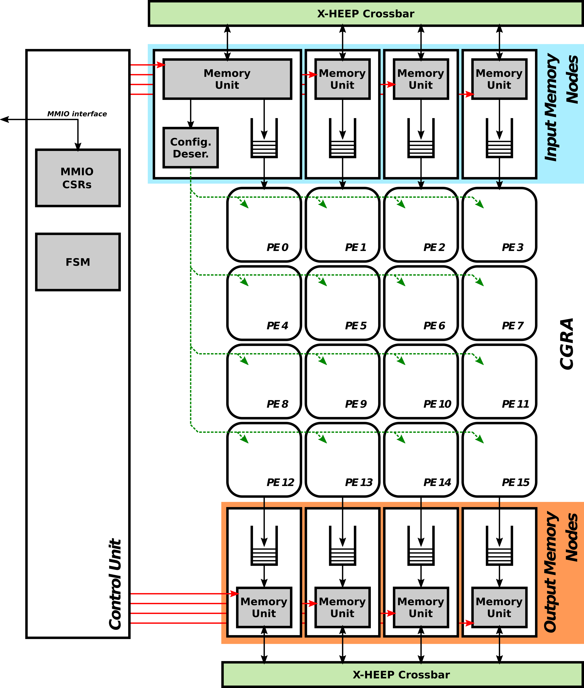

# STRELA (STReaming ELAstic CGRA)

---

### Introduction
STRELA is a reconfigurable streaming architecture designed for accelerating various compute-intensive tasks. This repository hosts the implementation and documentation of the STRELA architecture.

### Overview
STRELA leverages a Coarse-Grained Reconfigurable Array (CGRA) architecture to provide high throughput and energy efficiency for domain-specific applications. It is particularly suited for tasks requiring data parallelism and regular computation patterns.

### Features
- **Flexibility**: STRELA supports reconfiguration of its computational units, allowing for adaptability to different application requirements.
- **Efficiency**: By exploiting parallelism at the data level, STRELA achieves high throughput while minimizing energy consumption.

### Repository Contents
 - **Source Code**: Implementation of the STRELA architecture, including HDL files for hardware synthesis and software drivers for controlling the hardware.

### Block Diagram

### Author
- [Daniel Vázquez](https://github.com/danivz) - daniel.vazquez@upm.es

### License
This project is licensed under the Solderpad Hardware License, Version 2.1, see [License](./LICENSE) for details. SPDX-License-Identifier: Apache-2.0 WITH SHL-2.1

--- 
